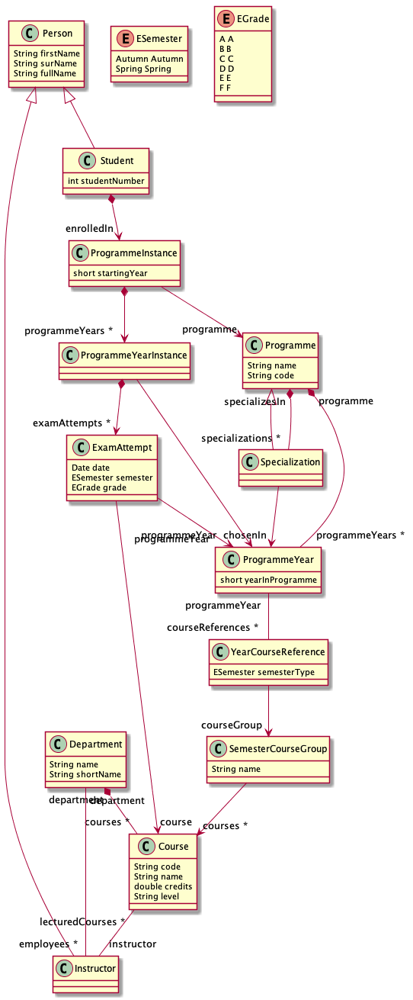
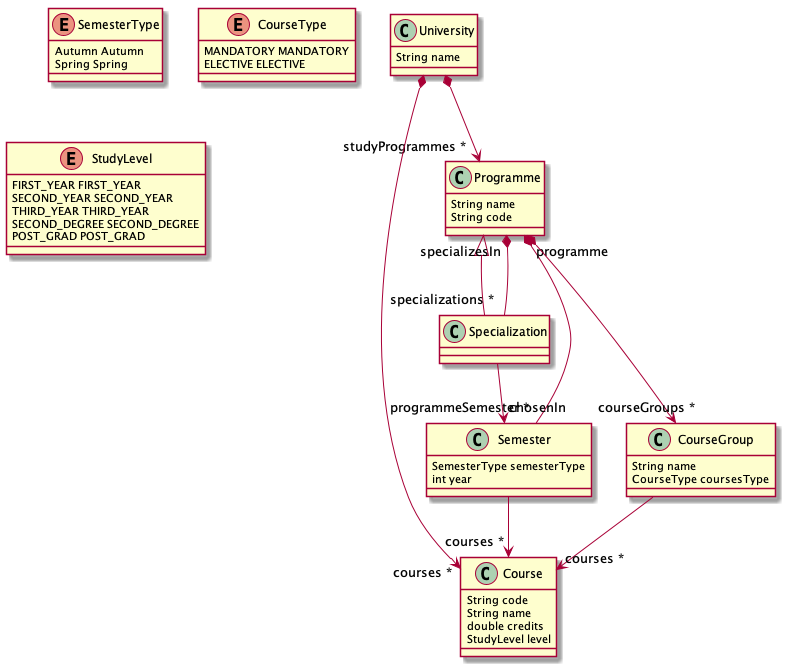

# tdt4250-2019
Repository for the assignments of the course TDT4250 at NTNU

# Assignment 1
## Structure
### `no.tdt4250.model`
contains the source code and the model
* `src` contains the generated source code
* `model` contains the ECore model, the generator model and a dynamic instance

### `no.tdt4250.model.tests`
contains the generated and the custom tests for the source code

### Model


# Assignment 2
## Get started
* Install BndTools
* Import all projects starting with `no.tdt4250.conversion` into the eclipse workspace

## Structure
 * `no.tdt4250.conversion.api`: defines the API for all other components / projects
 * `no.tdt4250.conversion.converter`: contains the used converter for converting the values (`TransientConverter`, which can convert value transiently)
 * `no.tdt4250.conversion.gogo`: the service for commands for gogo console
 * `no.tdt4250.conversion.servlet`: the service to start a servlet for humand readble output of the conversion
 * `no.tdt4250.conversion.temperature`: contains basic temperature conversions
 * `no.tdt4250.conversion.rest`: the rest service for converting values

## API
Start project `no.tdt.4250.conversion.rest`
Make an http `GET`-request to `localhost:8080` with parameters:
 * `value` (Double): the value that should be converted
 * `from` (String): the unit of value
 * `to` (String): the unit of the target converted value

For example: `localhost:8080/convert?from=Fahrenheit&to=Kelvin&value=20` returns following: 
```json
{
    "success": true,
    "value": 20,
    "converted": 266.4833333333333,
    "unitFrom": {
        "name": "Fahrenheit",
        "symbol": "°F"
    },
    "unitTo": {
        "name": "Kelvin",
        "symbol": "K"
    }
}
```
## Gogo Console
Commands:
 * `list`: lists all available direct conversions 
 * `add`: add a new conversion e.g.: `add "Centimeter(cm) = Inch(in) * 0.393 + 0"`

# Assignment 3
## Model
I simplified the model to the relevant data for Assignment 3


## Transformation
The model is transformated to `.html` wih Acceleo M2T. 
The package `no.tdt4250.model.html.main` contains the transformation.
The output for the instance `no.tdt4250.model/model/programmes.xmi` is [here](./no.tdtd4250.model.html/src/no/tdt4250/model/html/NTNU.html)
It was generated by the Acceleo Java Standalone. 

